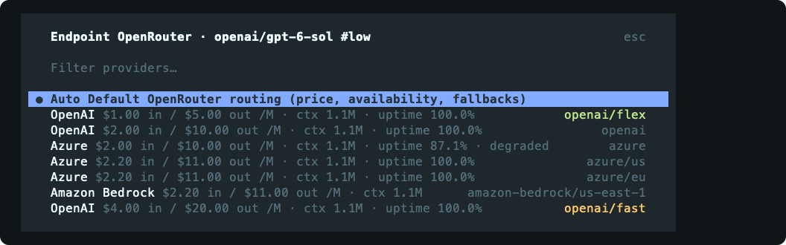
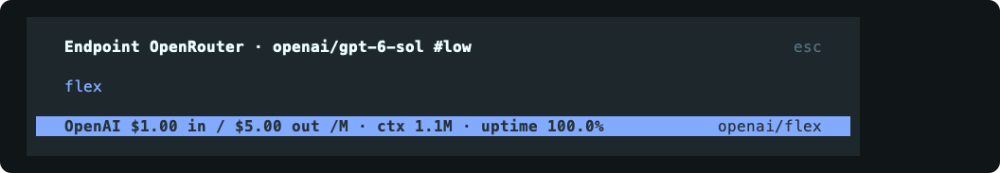
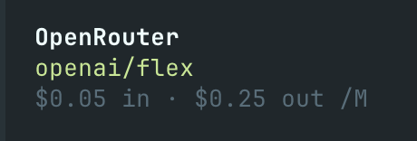
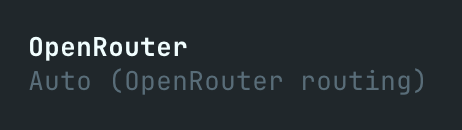

# OpenRouter Provider Manager for OpenCode

Choose the OpenRouter endpoint used by each model from inside OpenCode. The plugin shows endpoint details in `/provider`, remembers your choice per model, and displays the active route in the sidebar.



> Tested with OpenCode V2 2.0.16. Endpoint prices and availability in these captures are snapshots; check the picker for current values.

## Install from a local checkout

This repository is not published yet. You need OpenCode V2 and an OpenRouter account. Node.js 26 is the tested development version for this source checkout.

1. In a checkout of this repository, install the locked dependencies:

   ```sh
   npm ci
   ```

2. Add the checkout to `~/.config/opencode/opencode.jsonc`, replacing the example path with its absolute path:

   ```jsonc
   {
     "$schema": "https://opencode.ai/config.json",
     "plugins": ["/absolute/path/to/openrouter-provider-manager"],
   }
   ```

   If the file already has a `plugins` array, add the path to that array. OpenCode loads the package's server and TUI entry points together; no separate `cli.json` entry is needed. A checkout placed under `~/.config/opencode/plugins/` can also be [discovered automatically](https://opencode.ai/v2/docs/plugins).

3. Restart OpenCode. Run `/connect` and connect **OpenRouter**, then use `/models` to select an OpenRouter model. You can alternatively provide `OPENROUTER_API_KEY` to the OpenCode server. See the [OpenCode provider guide](https://opencode.ai/v2/docs/providers).

4. Run `/provider` to confirm the endpoint list opens for that model.

### Planned npm release

The planned package name is `opencode-openrouter-provider-manager`. Once it is published, the intended installation command is:

```sh
opencode plugin add opencode-openrouter-provider-manager
```

This command is **not available yet**. The planned GitHub repository is `SharkEzz/opencode-openrouter-provider-manager`; it is not linked here until it exists.

## Use the picker

1. Select an OpenRouter model with `/models`, then open `/provider` (or use the `leader+o` key binding).
2. Compare endpoints by input and output price in USD per million tokens, context length, quantization, uptime, and health. A warning appears when an endpoint does not support the selected reasoning variant.
3. Search by provider name or endpoint tag, then select an endpoint. The list is sorted by input price; green tags indicate `flex` and orange tags indicate `fast` or `priority`.
4. Select **Auto** to return to OpenRouter's normal routing. Choices are saved per model and apply across sessions.



| Pinned endpoint                                                                         | Auto routing                                                                  |
| --------------------------------------------------------------------------------------- | ----------------------------------------------------------------------------- |
|  |  |

## How routing works

When a model has a pin, the server plugin sets the outgoing OpenRouter request's `provider` field to the selected tag and disables fallback:

```json
{ "provider": { "only": ["openai/flex"], "allow_fallbacks": false } }
```

It leaves the model variant's reasoning settings and the rest of the request intact. If the pinned endpoint is unavailable, the request fails; use `/provider` to choose another endpoint or Auto. Endpoint metadata comes from OpenRouter and is cached for 10 minutes. With Auto, the plugin does not change the request body.

## Troubleshooting

- If `/provider` says the active model is not from OpenRouter, select one with `/models`.
- If endpoint loading fails, check the OpenRouter connection or `OPENROUTER_API_KEY` available to the OpenCode server.
- Colored tags and tag searching rely on OpenCode list fields that are not part of its public plugin types. They were verified on V2 2.0.16; check them again after upgrading OpenCode.

## TODO

- [x] Add the terminal picker, per-model endpoint pins, and Auto routing.
- [ ] Integrate with the OpenCode web environment.
- [ ] Integrate with the OpenCode IDE environment.
- [ ] Publish the package on npm and the repository on GitHub.
- [ ] Add automated TUI checks for filtering and endpoint colors across OpenCode updates.

## Development

Run `npm run typecheck`, `npm test`, `npm run format:check`, and `npm run lint:check` before submitting changes. Vitest covers the routing and endpoint logic; verify picker changes in OpenCode as well. See [AGENTS.md](AGENTS.md) for repository conventions.
